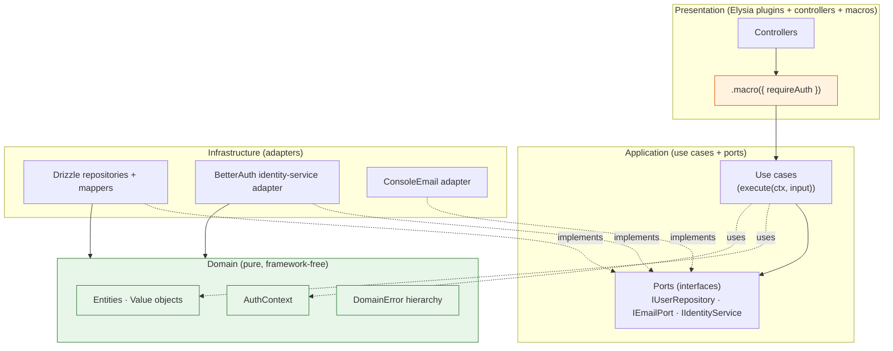
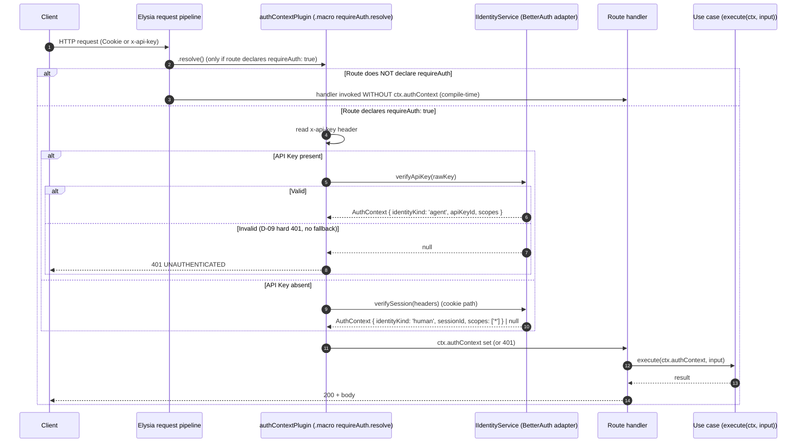
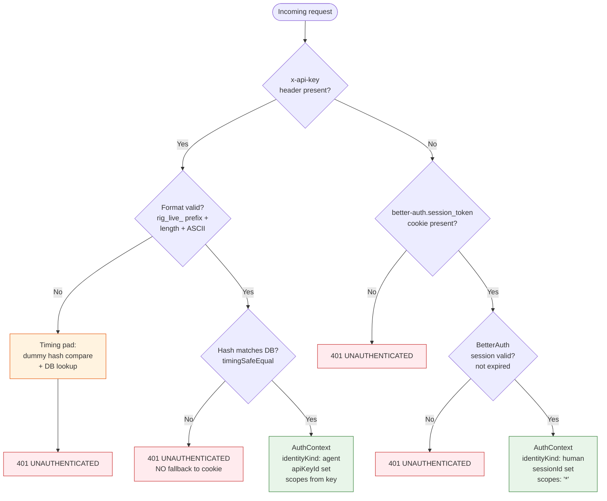

# Rigging Architecture

> Three diagrams + one regression matrix + one testing convention page.
> Code lives in [AGENTS.md](../AGENTS.md) and [docs/quickstart.md](quickstart.md).
> Decisions live in [docs/decisions/](decisions/).

Rigging is a thin **harness** — its value lies in the shapes it imposes, not in the volume of code it provides. The three diagrams below describe the three shapes that matter:

1. **DDD Four-Layer Architecture** — what depends on what, and what cannot.
2. **AuthContext Macro Flow** — how a request acquires `ctx.authContext` (and why a route without `requireAuth: true` cannot access it).
3. **Dual Identity Resolution** — how `x-api-key` takes precedence over the session cookie, and why a failed API Key never falls back.

If you understand these three pictures, you understand why Rigging "just doesn't let you" forget the auth check.

---

## 1. DDD Four-Layer Architecture

Rigging splits code into four layers with **strict directional dependency** rules. Biome's `noRestrictedImports` enforces the rules at lint time — `src/**/domain/**` cannot `import { ... } from 'drizzle-orm' | 'elysia' | 'better-auth'`. Violations break `bun run lint`, which breaks CI.

**Domain is framework-free** (Biome `noRestrictedImports` enforces zero `drizzle-orm` / `elysia` imports under `src/**/domain/`).

See ADR [0003](decisions/0003-ddd-layering.md) and ADR [0009](decisions/0009-rigidity-map.md).

---

## 2. AuthContext Macro Flow

Routes opt into authentication via Elysia's `.macro({ requireAuth: true })`. The macro is implemented by `authContextPlugin.resolve()`, which reads either the `x-api-key` header or the session cookie and produces a typed `ctx.authContext`. Routes that **do not** declare `requireAuth: true` cannot destructure `ctx.authContext` — the property is not in scope at the type level.

This is what we mean by "wrong patterns fail to wire": you cannot accidentally build a protected route that forgot to authenticate, because the type system refuses to compile a handler that destructures `authContext` without the macro flag.

See ADR [0006](decisions/0006-authcontext-boundary.md) and ADR [0007](decisions/0007-runtime-guards-via-di.md).

**Without `requireAuth: true`, `ctx.authContext` is not in scope — TypeScript refuses to compile a handler that destructures it.**

---

## 3. Dual Identity Resolution

Two auth tracks share the same `AuthContext` shape: human session cookie (issued by BetterAuth on `POST /api/auth/sign-in/email`) and Agent API Key (the `x-api-key` header). When both are present, **API Key wins**; when API Key is invalid, the request **does not** fall back to the cookie — it returns 401. The fallback would be a CVE-class vulnerability (an attacker who learns a valid cookie name could downgrade an Agent to a human session by also sending a malformed `x-api-key`).

Timing-safe comparison + a fixed timing-pad on malformed keys ensures latency does not leak whether the key was format-valid-but-hash-wrong vs format-malformed.

**API Key takes precedence over cookie. Failed API Key does NOT fall back to cookie** ([ADR 0011](decisions/0011-resolver-precedence-apikey-over-cookie.md)).
Timing-pad on malformed keys ensures latency does not leak format-vs-hash failure ([ADR 0011](decisions/0011-resolver-precedence-apikey-over-cookie.md)).

See ADR [0008](decisions/0008-dual-auth-session-and-apikey.md) and ADR [0011](decisions/0011-resolver-precedence-apikey-over-cookie.md).

---

## 4. Regression Test Matrix

These tests live alongside their feature integration tests (suffix `.regression.test.ts`) — co-located by feature for cleanup helper sharing, runnable independently via `bun run test:regression`. Each row is a CVE or known-pitfall regression alarm. If the suffix file is removed or the assertion weakened, that protection is gone.

| Test file | Protects against | Reference |
|-----------|------------------|-----------|
| `cve-2025-61928.regression.test.ts` | Unauth `POST /api-keys` with victim `userId` body field | [CVE-2025-61928](https://zeropath.com/blog/breaking-authentication-unauthenticated-api-key-creation-in-better-auth-cve-2025-61928) |
| `no-plugin-401.regression.test.ts` | AuthContext bypass if `authContextPlugin` not mounted | Pitfall #3 / AUX-06 |
| `timing-safe-apikey.regression.test.ts` | API Key timing attack via comparing string equality | AUX-04 / Pitfall #13 |
| `session-fixation.regression.test.ts` | Password reset must invalidate other sessions | AUTH-11 / Pitfall #6 / [OWASP](https://owasp.org/www-community/attacks/Session_fixation) |
| `resolver-precedence.regression.test.ts` | API Key MUST be evaluated before cookie (no order swap) | AUX-07 / [ADR 0011](decisions/0011-resolver-precedence-apikey-over-cookie.md) |
| `runtime-guard.regression.test.ts` | Domain service constructed without AuthContext throws at runtime | AUX-05 / Pitfall #1 |
| `password-hash-storage.regression.test.ts` | Password column never holds plaintext (DB row check) | AUTH-04 |
| `key-hash-storage.regression.test.ts` | API Key `hash` column hashed; raw key never stored | AUTH-13 / Pitfall #4 |

**E2E layer** (`tests/e2e/*.test.ts`) cross-checks several of these in cross-feature flows:

- `dogfood-happy-path.test.ts` — register → verify → login → agent → key → key-auth read (DEMO-04 echoed)
- `password-reset-session-isolation.test.ts` — session A invalidated, API Key K still valid (AUTH-11 in e2e layer + apiKey lifecycle independence)
- `cross-user-404-e2e.test.ts` — user B cookie + user B `x-api-key` both yield 404 on user A's resource

Run only regressions: `bun run test:regression`
Run only e2e: `bun test tests/e2e`
Run everything: `bun run db:migrate && bun test`

---

## 5. Testing Conventions

These conventions are enforced **socially** (not by lint) — but the integration helpers (`tests/integration/auth/_helpers.ts`, `tests/integration/agents/_helpers.ts`, `tests/e2e/_helpers.ts`) only support these patterns. Diverging requires writing your own helper from scratch, which is the friction signal that you're doing something the harness doesn't expect.

**Email namespace per test file.** Each test that creates a user uses `${prefix}-${Date.now()}-${randomSlug}@example.test`. This guarantees parallel test runs (Bun's default) never collide on the unique email constraint. Hardcoded test emails (`test@example.com`) are forbidden — they cause flaky cross-suite contamination.

**`afterAll` userId-scoped cleanup.** Each test that creates rows must call `cleanupUser(harness, userId, email)` in `afterAll`, which DELETEs from 6 tables in dependency order: `agent` → `apikey` → `account` → `session` → `verification` → `user`. The helper is idempotent (no need for try/catch noise).

**Use `harness.realApp.handle(new Request(...))` for e2e.** E2E tests exercise the full `createApp` plugin chain via `app.handle` (same-runtime), not a hand-wired Elysia or subprocess `fetch localhost:3000`. This catches plugin-ordering regressions (ADR 0012) that hand-wired tests miss.

**Integration vs E2E distinction:**

- **Integration** (`tests/integration/<feature>/`): single-feature HTTP path completeness (auth's API contract; agents's API contract). Uses hand-wired `makeTestApp()`.
- **E2E** (`tests/e2e/`): cross-feature business flows (auth + agents + apiKey interacting). Uses `makeE2eHarness()` which builds `realApp` over the same DB + BetterAuth that integration helpers use.

**No `.only`, no `.skip`, no `console.log` in committed tests.** The CI pipeline does not strip them; flaky-by-design tests must be removed, not muted.

**Coverage gate scope.** `scripts/coverage-gate.ts` enforces ≥80% line coverage on `src/**/domain/`, `src/**/application/`, and `src/shared/kernel/`. Other tiers (Infrastructure, Presentation, bootstrap) are reported but not gated — they are exercised by integration tests, not unit tests.

---

*Last updated: Phase 5 ship (2026-04-19+)*
*Diagram source: copy-paste from this file's mermaid blocks; GitHub renders natively in light/dark mode.*
*Diverging from a convention? File an ADR using [MADR 4.0 template](decisions/0000-use-madr-for-adrs.md).*
